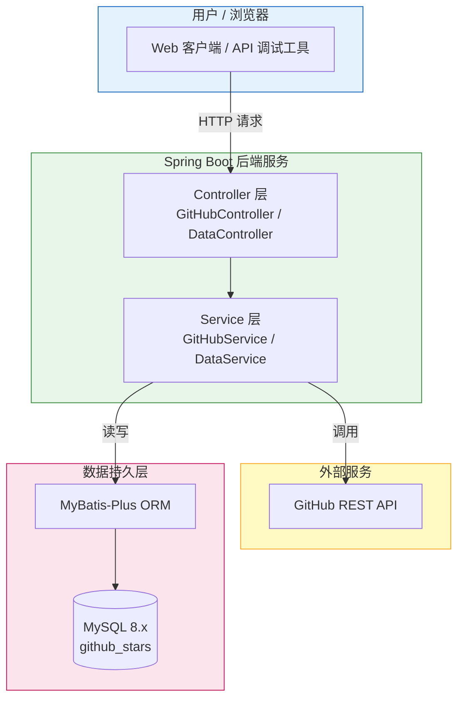

# JOSP-restoreGithubStars

GitHub Stars 整理和管理系统的后端服务。通过调用 GitHub API，帮助用户批量获取、Star / Unstar 仓库，并将 Stars 数据同步到本地 MySQL 数据库中进行持久化管理。

## 系统架构图



## 技术栈

| 技术 | 版本 |
|------|------|
| Spring Boot | 3.5.14 |
| Java | 25 |
| MyBatis-Plus | 3.5.7 |
| MySQL | 8.x |
| Knife4j | 4.5.0 |
| Hutool | 5.8.41 |
| Lombok | 1.18.40 |

## 项目结构

```
JOSP-restoreGithubStars/
├── src/main/java/wo1261931780/JOSP_restoreGithubStars/
│   ├── JospRestoreGithubStarsApplication.java    # 启动类
│   ├── client/
│   │   └── GithubClient.java                      # GitHub API 调用客户端
│   ├── config/
│   │   ├── CorsConfig.java                        # 跨域配置
│   │   ├── GlobalExceptionHandler.java            # 全局异常处理
│   │   ├── MybatisPlusConfig.java                 # MyBatis-Plus 配置
│   │   └── ShowResult.java                        # 统一响应封装
│   ├── controller/
│   │   ├── DataController.java                    # 数据同步与本地查询接口
│   │   └── GitHubController.java                  # GitHub Stars 操作接口
│   ├── DTO/
│   │   ├── GithubDTO.java                         # GitHub API 响应 DTO
│   │   ├── LicenseDTO.java                        # 许可证信息 DTO
│   │   ├── OwnerDTO.java                          # 仓库所有者 DTO
│   │   └── PermissionsDTO.java                    # 仓库权限 DTO
│   ├── entity/
│   │   ├── Repository.java                        # GitHub API 操作实体
│   │   └── Repositories.java                      # 数据库映射实体
│   ├── mapper/
│   │   └── RepositoriesMapper.java                # 数据访问层
│   └── service/
│       ├── DataService.java                       # 数据管理服务
│       └── GitHubService.java                     # GitHub API 业务服务
├── src/main/resources/
│   ├── application.yml                            # 应用配置文件
│   └── wo1261931780/JOSP_restoreGithubStars/mapper/
│       └── RepositoriesMapper.xml                 # MyBatis XML 映射
├── demo.sql                                       # 数据库初始化脚本
├── pom.xml                                        # Maven 构建配置
├── mvnw / mvnw.cmd                                # Maven Wrapper
├── LICENSE                                        # AGPL-3.0 许可证
├── README.md                                      # 项目说明
└── SPEC.md                                        # 技术规格文档
```

## 启动方式

### 1. 环境要求

- JDK 25
- Maven 3.6+
- MySQL 8.0+

### 2. 初始化数据库

```sql
CREATE DATABASE github_stars;
USE github_stars;
SOURCE demo.sql;
```

### 3. 配置应用

编辑 `src/main/resources/application.yml`：

```yaml
spring:
  datasource:
    url: jdbc:mysql://localhost:3306/github_stars?useSSL=false&useUnicode=true&serverTimezone=Asia/Shanghai&characterEncoding=utf8&zeroDateTimeBehavior=convertToNull&allowPublicKeyRetrieval=true&allowMultiQueries=true
    username: root
    password: your_password

github:
  token: your_github_token
```

### 4. 编译并运行

```bash
mvn clean install
mvn spring-boot:run
```

### 5. 访问服务

- 后端地址：http://localhost:8081
- API 文档：http://localhost:8081/doc.html

### 主要接口

| 功能 | 方法 | 端点 |
|------|------|------|
| 获取用户 Stars | GET | `/api/repositories/stars/{username}` |
| Star 仓库 | PUT | `/api/repositories/star` |
| Unstar 仓库 | DELETE | `/api/repositories/unstar` |
| 同步 Stars 到本地数据库 | PUT | `/data/queryAndSaveAllRepository` |
| 分页查询本地仓库 | GET | `/data/queryDatabase?page=1&limit=10` |

## 开源协议

本项目采用 [AGPL-3.0](LICENSE) 开源协议。
